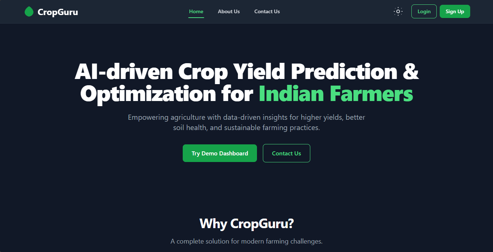

🌱 CropGuru – AI-Powered Crop Yield Prediction & Optimization

📌 Overview

CropGuru is an AI-driven platform designed to help farmers maximize crop yield, predict production, and optimize agricultural practices. By combining machine learning, real-time weather data, and soil parameters, the platform provides actionable insights for smarter farming.

👉 Live Demo: <a href="https://sih-nine-beta.vercel.app/">CropGuru on Vercel</a>

🚀 Features

🌾 AI-Powered Predictions – Accurate yield forecasts based on soil, crop, and weather data.

☁️ Weather Integration – Real-time weather insights to optimize irrigation and crop protection.

📊 Farmer Dashboard – Intuitive UI with yield charts, recommendations, and alerts.

📱 Responsive Design – Works seamlessly on mobile and desktop.

🛠️ Tech Stack

Frontend

⚛️ React.js (Vite for fast builds)

🎨 Tailwind CSS for modern, responsive UI

📈 Chart.js / Recharts for data visualization

Backend / AI

🐍 Python (FastAPI / Flask)

🌦️ OpenWeather API for weather data

🗄️ Supabase 

Deployment

▲ Vercel 
